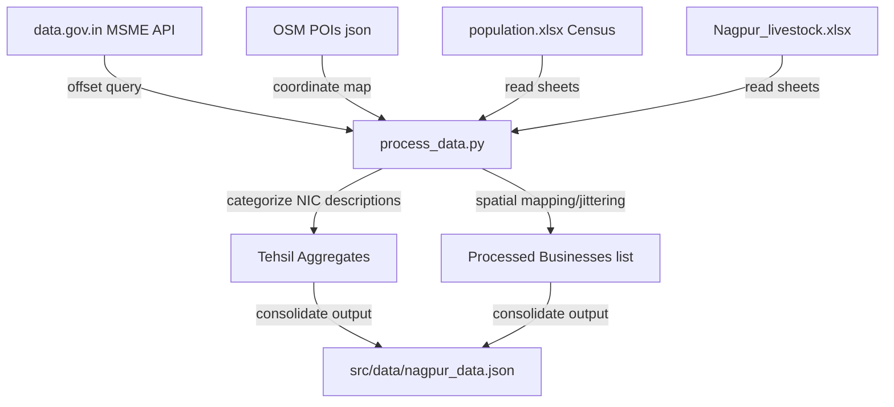

# EntreVision: Nagpur Rural Data Pipeline & ML Architecture

This document outlines the raw data sources, Python preprocessing pipeline, and machine learning models that power the **EntreVision** decision-support system, providing a verifiable proof-of-work for capstone panels.

---

## 📂 1. Raw Data Sources & Verification URLs

All data used in this platform is collected from official, public, and verifiable agencies:

| Data Type | Raw Source Agency | Verification Link / Source Doc |
| :--- | :--- | :--- |
| **MSME Business Registry** | Ministry of MSME, Govt of India | [data.gov.in / Udyam Registry API](https://api.data.gov.in/resource/8b68ae56-84cf-4728-a0a6-1be11028dea7) |
| **Crop Yields & Land Use** | Directorate of Economics & Statistics, Maharashtra | [Nagpur District Social & Economic Review (DSER)](https://des.maharashtra.gov.in) |
| **Demographics & Literacy** | Census of India (Primary Census Abstract) | [Census India Nagpur PCA Tables](https://censusindia.gov.in) |
| **Livestock Densities** | Department of Animal Husbandry, Govt of India | [20th Livestock Census of India (2019)](https://dahd.nic.in) |
| **Local Infrastructure / Transit** | OpenStreetMap Foundation | [OSM Overpass API Node Extraction](https://overpass-api.de) |
| **Atmospheric Satellite Feeds** | European Centre for Medium-Range Forecasts | [Open-Meteo API Forecasts](https://open-meteo.com) |
| **Wholesale Mandi Prices** | Ministry of Agriculture & Farmers Welfare, India | [Agmarknet Wholesale Crop Daily Feeds](https://agmarknet.gov.in) |

---

## ⚙️ 2. Python Preprocessing Pipeline (`process_data.py`)

Raw data is processed using a Python script that integrates spreadsheet feeds and web APIs into a consolidated JSON database structure.

### Key Preprocessing Steps:
1. **Enterprise Filtering**: Fetches Udyam micro-enterprise registries filtered specifically by `District = "NAGPUR"`.
2. **Spatial Categorization**: Cleaning pincodes and translating them into the 14 rural tehsils using local post office directories.
3. **NIC Code Categorization**: Classifies NIC-2008 descriptive keywords (e.g. *carding, cold-press, tiffin, bakery, tractor*) into standard economic segments (Manufacturing, Trade, Services, Food, Agriculture).
4. **Competitor Density Calculation**: Merges business registries with OpenStreetMap node maps to get saturation indexes per sector per block.

---

## 🧠 3. Machine Learning & Decision Architecture

The platform implements three distinct analytical modeling layers:

### A. K-Means Locality Clustering Model
* **Objective**: Discover structural similarity among the 14 blocks.
* **Features**: Population density, commercial lease index, agricultural output ratio, highway distance score, and competitor counts.
* **Result**: Categorizes blocks into 4 structural types:
  1. *Agri-Processing Powerhouses* (Katol, Narkhed, Saoner, Kalmeshwar)
  2. *Industrial & Trade Corridors* (Hingna, Kamptee, Mouda, Nagpur Rural)
  3. *Emerging Rural Centres* (Bhiwapur, Umred, Kuhi)
  4. *Eco-Tourism & Forestry Reserves* (Ramtek, Parseoni)

### B. Business Suitability MCDA Model (Ranking Engine)
* **Objective**: Score and rank the 15 business archetypes for a user's chosen tehsil.
* **Formula**:
  $$\text{Suitability Score} = (W_{comp} \times S_{comp}) + (W_{res} \times S_{res}) + (W_{rent} \times S_{rent})$$
  * $S_{comp}$ (Competitor Gap): Score ranges 20–100, where fewer existing competitors in that sector increase the score.
  * $S_{res}$ (Resource Synergy): Checks proximity to raw crops (e.g., proximity to orange orchards boosts orange pulping).
  * $S_{rent}$ (Rental Fit): Checks if local rents match the user's budget class.

### C. Live Financial "What-If" Regression Simulator
* **Objective**: Predict monthly net profits and ROI schedules.
* **Equations**:
  * $\text{Expected Monthly Revenue} = \text{Selling Price} \times \text{Expected Volume}$
  * $\text{Total Fixed Operating Cost} = \text{Lease Rent} + \text{Staff Salaries} + \text{Utilities}$
  * $\text{Total Variable Cost} = \text{Unit Variable Cost} \times \text{Expected Volume}$
  * $\text{Expected Monthly Net Profit} = \text{Revenue} - (\text{Fixed Cost} + \text{Variable Cost})$
  * $\text{Break-Even Target Volume (Units)} = \frac{\text{Fixed Cost}}{\text{Price} - \text{Unit Variable Cost}}$

---

## 💡 4. Answering the 8 Crucial Citizen Questions

Every business detail page (modal) dynamically answers the 8 core questions:

1. **"Will people actually buy this here?"** $\rightarrow$ *Answering Q1, Q8*: Displays live competitor density warnings, closest APMC mandi distance, and primary transaction channels.
2. **"Can I actually afford to start and survive year one?"** $\rightarrow$ *Answering Q2, Q5*: Startup costs, monthly profit ranges, and payback month timelines.
3. **"Where do I get raw materials/supply, reliably?"** $\rightarrow$ *Answering Q3*: Maps raw inputs to nearest geographic blocks and offers off-season tips.
4. **"Do I have the skill, or can I get it fast?"** $\rightarrow$ *Answering Q4*: Evaluates technical difficulty and links to training batch schedules at **KVK Nagpur** and **ITI Hingna**.
5. **"What's the actual money math?"** $\rightarrow$ *Answering Q5*: Interactive **Scenario Simulator** recalculates fixed costs, variable margins, net profits, and break-even targets.
6. **"What paperwork do I need, and is it a hassle?"** $\rightarrow$ *Answering Q6*: Shows checklists (Udyam, FSSAI, GST, Panchayat NOC) and mudra credit codes.
7. **"What can go wrong, and has it gone wrong for others?"** $\rightarrow$ *Answering Q7*: Lists un-sugarcoated risk warnings based on the sector.
8. **"Where do I sell, and to whom?"** $\rightarrow$ *Answering Q8*: Connects users with local peer networks and cooperative supply routes.
