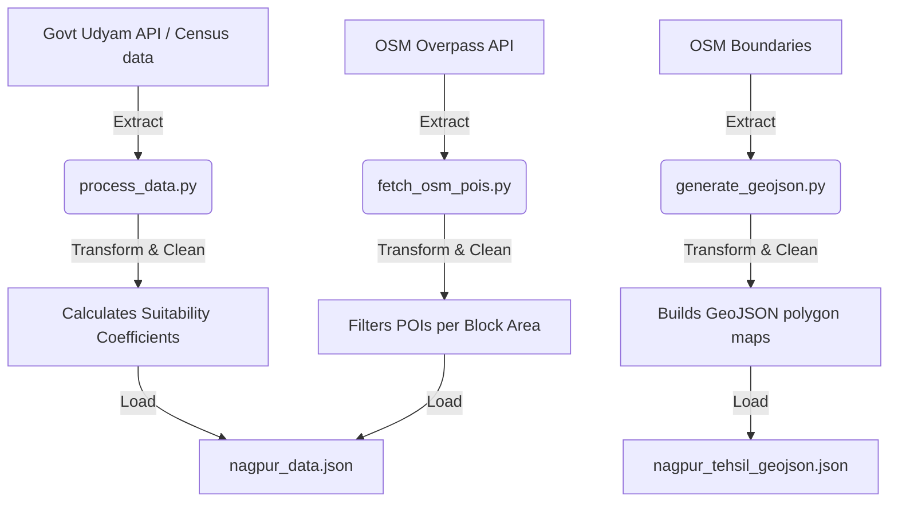

# 🚜 EntreVision Data Pipeline (ETL Suite)

This directory hosts the batch data pipeline scripts responsible for extracting regional demographics, wholesale market indices, and spatial business clusters, converting them into structured database entities.

---

## 🏛️ Pipeline Inventory

| Script | Purpose | Extraction Origin | Destination |
| :--- | :--- | :--- | :--- |
| `fetch_highways_amenities.py` | Extracts primary transportation nodes, highways, and logistics connectivity. | OpenStreetMap Overpass API | Local data cache |
| `fetch_osm_pois.py` | Pulls spatial coordinates of schools, hospitals, and clinics. | OSM Overpass Server | Local data cache |
| `generate_geojson.py` | Builds high-resolution polygon coordinates for Nagpur rural block maps. | OSM Overpass boundaries | `src/data/nagpur_tehsil_geojson.json` |
| `process_data.py` | Core ETL pipeline. Merges Census worker matrices, livestock densities, and MSME registrations. | Ministry of MSME Udyam API | `src/data/nagpur_data.json` |

---

## 🔁 ETL Sequence Diagram



---

## 🚀 Execution Instructions

Run all pipeline extractors sequentially to build the dashboard datasets:

```bash
# 1. Fetch transport networks and amenities
python fetch_highways_amenities.py
python fetch_osm_pois.py

# 2. Build map coordinates
python generate_geojson.py

# 3. Merge MSME registers and calculate suitability
python process_data.py
```
